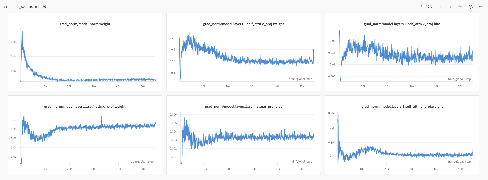
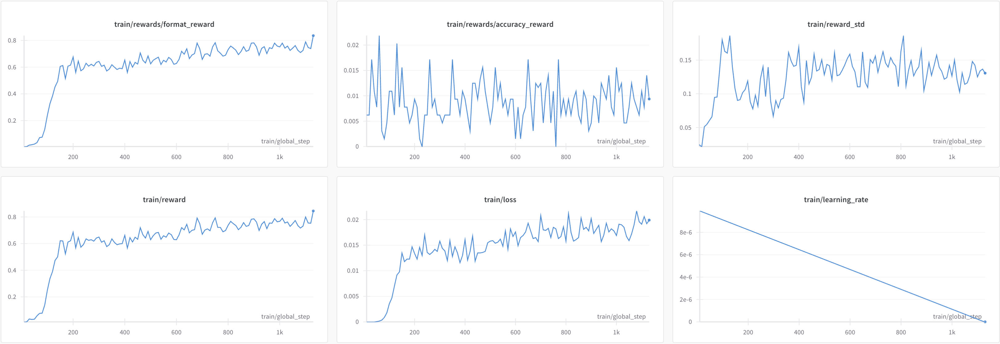

# Hands-on Large Language Model Projects

| project  | description                                  | code link                    |
| -------- | -------------------------------------------- | ---------------------------- |
| pretrain | Pretrain a LLM with using opensource dataset | [pretrain.py](./pretrain.py) |
| pretrain | Fine tuning LLM enable Chain of Thought with GRPO | [fine_tuning_llm_grpo_trl.py](./fine_tuning_llm_grpo_trl.py) |


## Preparation
Please install [uv](https://github.com/astral-sh/uv) first.
```
git clone https://github.com/duoan/hands-on-llm-projects.git
cd hands-on-llm-projects
uvx sync
source .venv/bin/activate

# install flash attention
uv pip install flash-attn --no-build-isolation

```
---

## Pretrain

I use [`Qwen2.5`](https://huggingface.co/docs/transformers/en/model_doc/qwen2) model and trained with [TinyStories](https://huggingface.co/datasets/roneneldan/TinyStories) dataset. 

Since the original QWEN2 model default parameter is too large (billions level) for this small dataset. So I customized the config as the following, and use GPT2 tokenizer lower down the vacab_size from `151,936` to `50,257`
```python
config.hidden_size = 768           # Keep same as GPT2
config.intermediate_size = 768 * 4 # Use classical 4 times hidden_size
config.num_hidden_layers = 2       # Only use 2 hidden layers in MLP
config.num_attention_heads = 8     # keep same as GPT2
config.num_key_value_heads = 2     # Use Group Query Attention (GQA), to reduce the calculation complixity
config.attention_dropout = 0.1     # Avoid the model overfitting
```

By this change, the totally trainable parameters to 111M. The model is trained speed up mixed the following improvement configuration
- `flash_attention_2` 
- `bf16` percision
- `adamw_torch_fused` optimizer
- `gradient_checkpointing` for saving GPU memory
- `cosine_with_restarts` learning rate scheduler


All the metrics are reported to W&B. The model converged around 30K steps, train loss: 1.52, eval loss: 1.52.


I implemented the cusomized `TrainerCallback` to monitor and learn the model performance
- `TextGenerationCallback` which will auto generate the story with a fixed prompt
- `ParameterMonitorCallback` which is a parameter monitor to regular report the parameter distribution, grad norm to W&B





The model is auto stop training with `EarlyStoppingCallback` when no more than `0.1` loss improvement on eval dataset for 5 rounds. 


```
# Single GPU
python pretrain.py

# Multi GPUs
# Update accelerate_config.yaml accordingly.
accelerate launch --config-file accelerate_config.yaml pretrain.py
```

#### Story AI Evolve History
```
{'eval_loss': 7.740833282470703, 'eval_runtime': 28.623, 'eval_samples_per_second': 768.263, 'eval_steps_per_second': 24.037, 'epoch': 0.02, 'num_input_tokens_seen': 15518304} 
[Step 500] Generated Text: A long time agomotionmotionmotionmotionmotionDearDearDearDearDearietsietsietsietsietsietsElseElseElseElseElseElseElseElseElseElseElseElseElseElseElseElseElseElse I I I I I I I I I I I I I I I I I awake awake awake awake awake awake awake awake awake awake awake awake awake awake awake awake awake awake awake awake awake awake awake awake awake awake awake awake awake awake awake awake awake awake awake awake awake awake awake awake awake awake awake awake awake

[Step 1000] Generated Text: A long time ago the the the. She was a big and the park. She was so happy and the park. She was so happy. She was so happy. She was so happy. She was so happy. She was so happy. She was so happy. She was so happy. She was so happy. She was so happy. She was so happy. She was so happy. She was so happy. She was so happy. She was so happy. She was so happy. She

[Step 1500] Generated Text: A long time ago and Ben were playing in the park. They had a big, they were a big, and a big, and a big, and a big, and a big, a big, a big, a big, and a big, and a big, and a big, a big, a big, a big, a big, a big, a big, a big, a big, a big, a big, a big, a big, a big, a big

[Step 2000] Generated Text: A long time ago and the park. They like to play with the park. One day, they saw a big tree. It was a big and a big tree. It was a big, a big, a big tree. It was a big, a big, a big tree. It was a big, a big, a big, a big, a big, a big, a big, a big, a big, a big, a big, a big, a big

[Step 2500] Generated Text: A long time ago and the park. They like to play with their toys and make a big box. They have a big box and a big box. They have a big box and a big dog. "Look, a big dog!" Ben says. "I want to play with the dog. It is a big dog. It is a big dog. It is a big dog. It is a big dog. It is a big dog. It is a big dog. It is

[Step 3000] Generated Text: A long time ago and the park. They see a big tree and a big tree. They have a big box and a big tree. They are very happy. "Look, a big dog!" Tom says. "I want to play with the dog!" "I want to play with the dog!" Tom says. "I want to play with the dog. It is a big dog. It is a big dog. It is a big dog. It is a big dog

[Step 3500] Generated Text: A long time ago and his mom were playing in the park. They saw a big tree with a big tree. The tree was very happy and wanted to go to the tree."Look, it's a big tree!" said the tree. "I want to play with the tree!" The tree was very sad. He wanted to play with the tree. He saw the tree and said, "I'm sorry, I can't be careful. I can help you."

[Step 4000] Generated Text: A long time ago and his mom were playing in the park. They saw a big tree with a big tree. The tree was very big and had a big box. The tree was very happy and thanked the tree. The tree was very happy. He said, "I want to play with you, but I have to be careful." The tree was very happy and thanked the tree. The tree was so happy. He said, "I'm sorry, I'm sorry.


[Step 29500] Generated Text: A long time ago, there was a little girl named Lily. She loved to play outside in the park. One day, she saw a big, red ball. She wanted to play with it, but it was too high for her to reach.Lily asked her mom for help. Her mom said, "Let's get the ball for you, Lily." They went to the store and found the ball. Lily was so happy! She played with the ball all day.

[Step 50500] Generated Text: A long time ago, there was a little girl named Lily. She loved to play outside in the sun. One day, she went to the park with her mom and saw a big tree with a swing hanging from it. She wanted to swing on it too. Lily's mom said, "Be careful, Lily. The swing is very high and you might fall." Lily nodded and ran to the swing. She sat on the swing and pushed herself. She felt the wind in her

```
----

## Fine Tuning - Chain of Thought
I fine tune `Qwen/Qwen2-0.5B-Instruct` model with `AI-MO/NuminaMath-TIR` dataset.



```
618 [Step 1120] Generated Reasoning: A conversation between User and Assistant.The user asks a question, and the Assistant solves it.The assistant first thinks about the reasoning process in the mind step by step and then provides the user with the answer.The reasoning process and answer are must strictly enclosed within <think> </think> and <answer> </answer> tags, respectively, i.e., <think> reasoning process here </think><answer> answer here </answer> In 1988, a person's age was equal to the sum of the digits of their birth year. How old was this person?<think> The sum of the digits of my birth year is equal to my age.</think> <answer>35</answer>
619 
620 The sum of the digits of my birth year is equal to my age.
621 
622 {'loss': 0.0192, 'grad_norm': 0.40944114327430725, 'learning_rate': 8.849557522123894e-08, 'completion_length': 29.990625, 'rewards/format_reward': 0.7390625, 'rewards/accuracy_reward': 0.0140625, 'reward': 0.753125, 'reward_std': 0.1367921955883503, 'kl': 0.48006264908472074, 'epoch': 4.94}
623 
624 [Step 1130] Generated Reasoning: A conversation between User and Assistant.The user asks a question, and the Assistant solves it.The assistant first thinks about the reasoning process in the mind step by step and then provides the user with the answer.The reasoning process and answer are must strictly enclosed within <think> </think> and <answer> </answer> tags, respectively, i.e., <think> reasoning process here </think><answer> answer here </answer> In 1988, a person's age was equal to the sum of the digits of their birth year. How old was this person?< <think> reasoning process here </think> <answer>25</answer> </answer>
625 
626 {'loss': 0.0199, 'grad_norm': 0.6182273030281067, 'learning_rate': 0.0, 'completion_length': 25.715625, 'rewards/format_reward': 0.8359375, 'rewards/accuracy_reward': 0.009375, 'reward': 0.8453125, 'reward_std': 0.1306655988097191, 'kl': 0.4982221235317411, 'epoch': 4.98}
627 {'train_runtime': 27084.6487, 'train_samples_per_second': 0.669, 'train_steps_per_second': 0.042, 'train_loss': 0.01459620625815515, 'epoch': 4.98}
```

> the training result is not good, since I only trained 5 hours with small GPU instance. But you can see the model trying to follow the required format response.
---